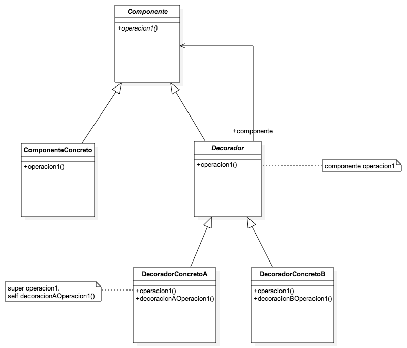

# Decorator

### Intro
Este patrón permite añadir funcionalidad dinámica y transparentemente a un objeto, valiéndose de clases que entienden los mismos mensajes que este. Cuando estas clases (las decoradoras) reciben un mensaje propio del objeto decorado, primero lo delegan en él y luego efectúan su comportamiento, el agregado por sobre el original.

Una de las cosas sobre las que se hace hincapié, y que resulta muy interesante, es la anidación de decorators. Esto consiste, naturalmente, en que un decorator, en lugar de conocer a un objeto decorado, conozca a otro decorator; así, cuando se envía un mensaje, se van agregando las funcionalidades intermedias de los decorators intermedios.

Bien, todo muy rico. Pero hay una cosa que no queda clara. Si se tiene, como en el ejemplo del libro, el DecoradorDesplazamiento, que implementa el método #desplazar, ¿cómo haría alguien desde afuera para invocarlo? O sea, no sería transparente en este caso. Y si hubiera un decorador por encima de él, debería proveer también un mensaje #desplazar, si no el método original sería inalcanzable. De igual forma debería hacerlo con todos los métodos que requieran ser invocados intencionalmente, lo que resultaría en muchos métodos definidos que no harían nada en muchas clases de la misma familia de decorators. Finalmente, no resulta tan catastrófico; antes de ponerlo por escrito parecía más problemático.

### Aplicabilidad
- Se quiere añadir funcionalidad dinámicamente, y que esto sea transparente para los objetos clientes.
- Se quiere añadir y/o quitar funcionalidad dinámicamente.
- Se quiere extender una clase pero la herencia es inviable.

### Estructura - Participantes

- **Componente**: clase abstracta que determina la interfaz de las clases que podrán ser decoradas.
- **ComponenteConcreto**: clases concretas que podrán ser decoradas.
- **Decorador**: clase abstracta que heredará la misma interfaz que las clases componentes, conocerá un objeto componente y, en principio, redirigirá todos los mensajes hacia este.
- **DecoradorConcreto**: heredará de Decorador y añadirá funcionalidad en donde corresponda.

### Colaboraciones
Decorador redirige todos los mensajes al Componente; DecoradorConcreto añade funcionalidad antes o después de redirigir el mensaje.

### Consecuencias
1. La extensión es más simple y flexible que con la herencia. Mientras que en la segunda tendríamos una explosión de subclases en ciertas situaciones, con un decorator la agregación de funcionalidad sería principalmente dinámica, transparente a los clientes e independiente entre sí (las funcionalidades se agregan de forma separada).
2. Se tiene sólo la funcionalidad requerida en un momento dado. En lugar de tener una clase padre muy cargada de métodos, con sus correspondientes subclases también cargadas de métodos, se tienen clases que se van agregando al objeto "pequeño" original, y que le van añadiendo la funcionalidad correspondiente.
3. Se debe ser cuidadoso con los decorators y la identidad. Un componente y su decorador no son idénticos.
4. Se tienen muchos objetos pequeños con variadas interrelaciones. Esto resulta muy adaptable, extensible y reusable para quienes están familiarizados con el diseño, y engorroso de aprender y depurar para los que no. (Fuck los que no.)

### Implementación
1. El decorador debe implementar la misma interfaz que el componente, ya que deberá ser transparente para los clientes. Una rica forma de que el decorador delegue todos los mensajes que no le corresponden en el componente es mediante la metaprogramación y la redefinición del método doesNotUnderstand en el componente.
2. La clase abstracta Decorador no es necesaria si hay y habrá un sólo decorador.
3. Mantener la clase componente ligera, lo que permitirá mantener las clases decoradoras ligeras. Implementar una parte de la funcionalidad en las subclases. **Sí, re piola, pero cómo uso la funcionalidad de las subclases si yo conozco a la superclase**.
4. Este punto es más una aclaración que otra cosa. *Cambiar la piel de un objeto en vez de las tripas*. Lo que estamos haciendo acá es agregar un envoltorio transparente de funcionalidad al objeto componente (por eso la analogía con la piel), ya que mantiene su funcionalidad original pero agrega nueva, y además nosotros no nos percatamos de que estamos tratando con un objeto diferente.

### Dudas
1. En el caso de tener un decorator con mensajes propios, como podría ser #desplazar:x, deberíamos romper con la premisa de la transparencia. ¿Esto sería correcto?
2. *Según el lugar, conocer al componente como un decorator o como el objeto original.* Al final de la sección de *Código de ejemplo* habla de interactuar con los objetos componentes directamente o con los decoradores según sea conveniente, desde diferentes lugares del código. Bueno en realidad el ejemplo que da es bastante explicativo: un objeto texto con el cual seguiremos interactuando de forma directa, pero que le daremos a un objeto ventana envuelto en decoradores, ya que así es como queremos que lo utilice la ventana. ¿Así sería la cuestión?
3. En el punto 3 de la sección *Implementación* habla de poner en la clase Componente la funcionalidad esencial y el resto en las subclases, manteniéndola así ligera. Este tema debe estar relacionado con la duda 2, ya que seguramente nosotros usamos un objeto dado (hijo de re mil hijo de Componente) y le ponemos unos decoradores al momento de dárselo a otro cierto objeto; allí el decorador lo tratará como un objeto componente, que es todo lo que necesita para decorarlo. ¿Será que estoy en lo correcto?