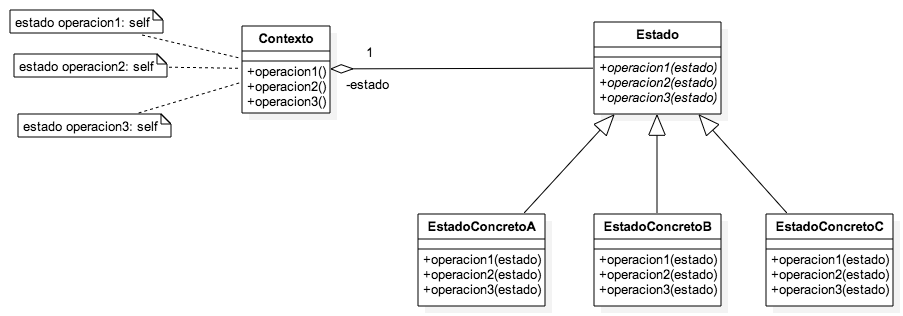
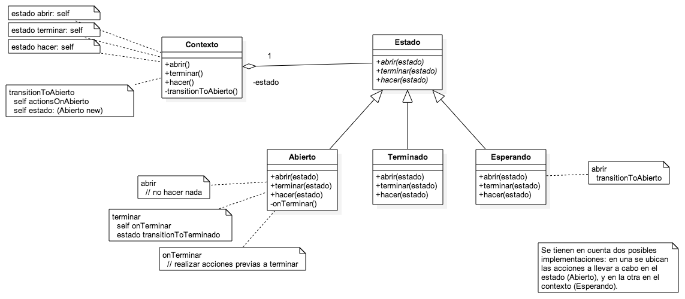

# State

### ¿Qué soluciona?

Hay objetos que guardan un estado interno, el cual determina las reacciones que puede tener frente a distintos estímulos. Por ejemplo, un objeto Heladera pasará del estado *cerrada* a *abierta* cuando se le mande el mensaje *abrirPuerta*, pero no hará nada cuando se le envía *abrirPuerta* si ya se encuentra en estado *abierta*.

En el paradigma procedural, esto se solía solventar con una variable de instancia a la que se le asignaban estados representados mediante constantes enteras. Luego, ante un estímulo, se definía el curso de acciones a realizar a partir de un switch sobre la variable de estado.

*¿Y cuál es el problema con eso?* Extensibilidad y mantenimiento. Dicha sentencia condicional suele encontrarse en muchos lugares en el código, y los cambios deben verse reflejados en todos ellos.

### ¿Qué aporta a mi modelo?

- Capacidad de agregar estados sin mayor esfuerzo.
- Desacoplamiento entre el contexto y sus estados, transformándose cada uno de estos en un objeto aparte con su propio comportamiento.
- Delegación de las responsabilidades del contexto en su estado, que probablemente deberá conocer al primero.
- La información requerida por cada estado existe sólo en aquellos que lo requieren, eliminando las variables opcionales.

### Trade-offs

##### Cambios de estado hechos por el contexto vs por el estado

En el primer caso se debería incluir en el contexto la lógica de cambios de estado, lo que puede incurrir en una situación de condicionales parecida a la que nos trajo al patrón en un principio. En el segundo, existe una dependencia de implementación/representación entre los estados, ya que cada uno deberá conocer a todos aquellos a los que pueda cambiar.

##### Una instancia de estado por contexto vs una instancia de cada estado para todo el sistema

Se puede optar por que cada contexto cree y destruya una instancia para cada estado requerido, o generar una instancia de cada estado al principio y que luego se asignen estas a los contextos.

Para definir la opción más conveniente se deben tener en cuenta algunos aspectos:
- Cantidad de objetos contexto.
- Cantidad de estados definidos.
- Frecuencia de transiciones entre estados.
- Información almacenada por cada objeto estado.

Para muchos objetos contexto, alta frecuencia de cambios de estado y nada de información almacenada en el estado, puede adaptarse mejor la segunda opción, disminuyendo la cantidad de objetos y de overhead por creación y destrucción de los mismos.

Si los estados no son tan dinámicos y guardan cierta información, puede adecuarse más la primer opción, ya que de otra forma cada contexto debería guardar la información requerida por el estado para pasársela en cada operación.

### Estructura, objetos, responsabilidades y colaboraciones

##### Abstracta

##### Ejemplo
